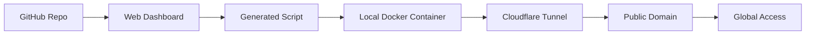

# Dployme

**One-click deployment from GitHub to your local machine with global domain access**

## Core Idea

Dployme bridges the gap between local development and public accessibility by providing a seamless deployment pipeline that connects your GitHub repositories directly to your local machine through secure tunnels. Instead of dealing with complex cloud deployments or expensive hosting for simple project showcases, Dployme generates custom deployment scripts that automatically containerize your applications and expose them to the internet via custom or auto-generated domains.

The magic happens in three simple steps: authenticate with GitHub on our hosted dashboard, select any repository with a Dockerfile, and download a personalized script that handles everything from container building to tunnel creation. Within minutes, your local application is running in a Docker container and accessible worldwide through a clean domain name, perfect for portfolio demonstrations, client previews, or quick prototyping.

---

## ✨ Features

- **GitHub Integration**: Seamlessly browse and deploy from your private and public repositories
- **Zero Configuration**: Just ensure your repo has a Dockerfile - we handle the rest
- **Custom Domains**: Bring your own domain or use our auto-generated subdomains
- **Secure Tunneling**: Powered by Cloudflare Tunnel for reliable, secure connections
- **Real-time Monitoring**: Live deployment status, logs, and container health from the dashboard
- **Cross-Platform**: Generated scripts work on Windows, macOS, and Linux
- **Multi-Project Support**: Run multiple applications simultaneously on different subdomains
- **No Cloud Costs**: Deploy to your own hardware - no hosting fees

## 🛠️ How It Works



### 1. **Connect & Configure**
- Login with GitHub OAuth
- Browse your repositories
- Select deployment target
- Configure domain preferences

### 2. **Download & Deploy**
- Download custom deployment script
- Run script on your local machine
- Script handles cloning, building, and tunnel setup

### 3. **Monitor & Manage**
- View real-time deployment status
- Access container logs
- Manage multiple deployments
- Share public URLs

## 🚀 Quick Start

1. Visit the [Dployme Dashboard](https://Dployme.dev)
2. Authenticate with your GitHub account
3. Select a repository with a Dockerfile
4. Configure your deployment settings
5. Download and run the generated script:
   ```bash
   chmod +x deploy-myapp.sh
   ./deploy-myapp.sh
   ```
6. Your app is now live at `https://myapp-abc123.Dployme.dev`

## 📋 Requirements

### Repository Requirements
- Valid Dockerfile in repository root
- Exposed port configuration in Dockerfile
- Optional: docker-compose.yml for multi-service apps

### Local Machine Requirements
- Docker installed and running
- Internet connection for tunnel establishment
- Basic shell access (bash/PowerShell)

### Supported Platforms
- **Linux**: Ubuntu 18.04+, CentOS 7+, Debian 10+
- **macOS**: 10.14+
- **Windows**: Windows 10+ with WSL2 or PowerShell

## 🏗️ Architecture

### Components
- **Web Dashboard**: Next.js frontend with GitHub API integration
- **Backend API**: Node.js/Express with PostgreSQL database
- **Script Generator**: Dynamic shell script creation with embedded configs
- **Tunnel Manager**: Cloudflare Tunnel integration for secure routing
- **Container Orchestrator**: Docker management and health monitoring

### Security Features
- OAuth 2.0 authentication with GitHub
- Time-limited deployment tokens
- Encrypted tunnel connections
- Container isolation and resource limits
- Automatic cleanup on deployment termination

## 🔧 Technical Stack

**Frontend Dashboard:**
- Next.js 14 with TypeScript
- Tailwind CSS for styling
- Real-time updates via WebSocket

**Backend Services:**
- Node.js with Express framework
- PostgreSQL for user and deployment data
- Redis for session management and caching

**Infrastructure:**
- Cloudflare Tunnel for secure routing
- GitHub API for repository access
- Docker for containerization
- WebSocket for real-time communication

## 📊 Use Cases

### Perfect For:
- **Portfolio Showcases**: Quickly demo projects to potential employers
- **Client Presentations**: Show work-in-progress to clients without complex setups
- **Prototype Testing**: Rapid deployment for testing and feedback
- **Learning Projects**: Hands-on experience with modern deployment practices
- **Development Workflow**: Easy sharing of local development environments

### Not Suitable For:
- Production applications requiring high availability
- Applications with persistent data requirements
- High-traffic commercial applications
- Services requiring guaranteed uptime SLAs

## 🛣️ Roadmap

### Phase 1: MVP (Current)
- [x] GitHub OAuth integration
- [x] Repository selection and browsing
- [x] Basic script generation
- [x] Docker container deployment
- [x] Cloudflare Tunnel integration

### Phase 2: Enhanced Features
- [ ] Custom domain management
- [ ] Real-time deployment monitoring
- [ ] Container health checks and auto-restart
- [ ] Deployment history and rollbacks
- [ ] Environment variable management

### Phase 3: Advanced Capabilities
- [ ] GitHub webhook integration for auto-deployment
- [ ] Multi-service application support
- [ ] Resource monitoring and alerts
- [ ] Team collaboration features
- [ ] API access for programmatic deployments

## 🤝 Contributing

This is primarily a portfolio/showcase project, but suggestions and feedback are welcome!

## 📄 License

MIT License - feel free to use this concept for your own projects

## 🔗 Links

- [Live Dashboard](https://Dployme.dev) *(Coming Soon)*
- [Documentation](https://docs.Dployme.dev) *(Coming Soon)*
- [GitHub Repository](https://github.com/yourusername/Dployme) *(Coming Soon)*

---

*Built with ❤️ to showcase modern deployment practices and full-stack development skills*